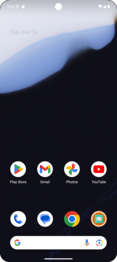
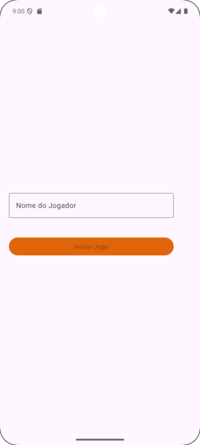

# Las Vegas Dicee
Is a project tha sum value two dicee when user click in button _Roll_

### Authors

- [@josealmir](https://www.github.com/josealmir)

### Repository
- [@dicee](https://github.com/josealmir/DataGame)

### Tech Stack

**Client:** Android, Java 

## Color Reference

| Color             | Hex                                                                |
| ----------------- | ------------------------------------------------------------------ |
| Example Color |  #E06408 |
| Example Color |  #F89B56 |

### View app

